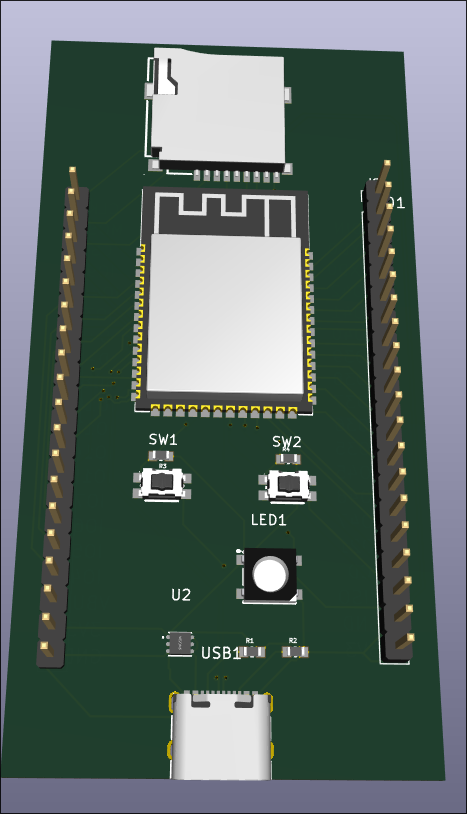
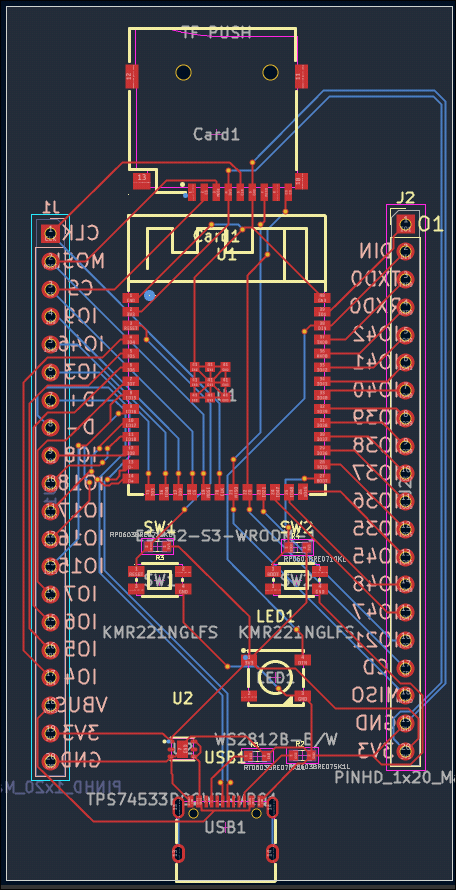
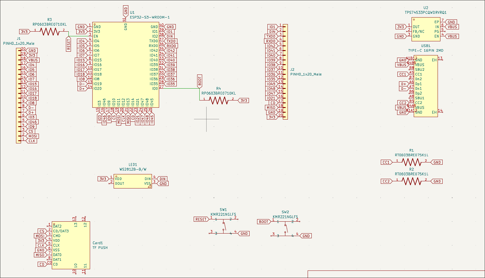

# devkit2

A compact ESP32-S3 development board designed for rapid prototyping and embedded projects.

## Features

- **ESP32-S3-WROOM-1** module — dual-core Xtensa LX7, 2.4 GHz Wi-Fi, BLE 5.0, 8 MB PSRAM, 16 MB Flash
- **USB-C** connector for power, programming, and serial monitor
- **WS2812B** addressable RGB LED on GPIO 2
- **microSD card** slot (TF-PUSH) connected via SPI
- **2× tactile push buttons** — Boot (GPIO 0) and Reset (EN)
- **2× 20-pin breakout headers** bringing out all available GPIO, power rails, and peripheral signals
- **3.3 V LDO regulator** (TPS74533) — up to 500 mA output, 6.5 V max input
- **Compact form factor** — fits on a breadboard with one row of pins free on each side



## Pin Map

```
                    ┌──────────────────┐
             3.3V —│ J1               │— GND
             EN   —│                  │— VIN (5 V)
            IO4   —│                  │— IO5
            IO6   —│                  │— IO7
            IO15  —│                  │— IO8
            IO16  —│                  │— IO9
            IO17  —│                  │— IO10
            IO18  —│                  │— IO11
            IO19  —│                  │— IO12
            IO20  —│                  │— IO13
            IO21  —│    ESP32-S3      │— IO14
            IO26  —│    devkit2       │— IO38
            IO35  —│                  │— IO39
            IO36  —│                  │— IO40
            IO37  —│                  │— IO41
            IO42  —│                  │— IO45
            IO43  —│                  │— IO46
            IO44  —│                  │— IO47
            GND   —│                  │— IO2  (onboard LED)
            5 V   —│                  │— IO0  (Boot button)
                   └──────────────────┘
```

| Peripheral   | GPIO | Notes                         |
|-------------|------|-------------------------------|
| WS2812B LED | 2    | DIN, use NeoPixel lib         |
| Boot button | 0    | Pull LOW to enter download mode |
| Reset button| EN   | Pulls EN pin LOW              |
| microSD CS  | 5    | SPI chip select               |
| microSD MOSI| 11   | SPI data                      |
| microSD MISO| 13   | SPI data                      |
| microSD SCK | 12   | SPI clock                     |

## Getting Started

### 1. Add Board Support

Install the **esp32** board package by Espressif in the Arduino IDE:

1. Open **File → Preferences**
2. Add this URL to **Additional Boards Manager URLs**:
   ```
   https://espressif.github.io/arduino-esp32/package_esp32_index.json
   ```
3. Open **Tools → Board → Boards Manager**, search for `esp32`, and install **esp32 by Espressif Systems**

### 2. Select Board Settings

| Setting          | Value                     |
|-----------------|---------------------------|
| Board            | ESP32S3 Dev Module        |
| USB CDC On Boot  | Enabled                   |
| Flash Size       | 16 MB (128 Mb)            |
| PSRAM            | OPI PSRAM                 |
| Upload Mode      | UART / Hardware CDC       |

### 3. Install Libraries

Install these libraries via **Tools → Manage Libraries**:

- **Adafruit NeoPixel** — for the onboard WS2812B LED
- **SD** (built-in, or **SdFat**) — for the microSD slot

### 4. Upload the Demo

Hold **Boot** (SW1), press and release **Reset** (SW2), then release **Boot** to enter download mode. Open `CODE/demo/demo.ino` in the Arduino IDE, select the correct port, and hit **Upload**.

## Bill of Materials

| Designator | Qty | Value               | Footprint                    | LCSC #    |
|-----------|-----|---------------------|------------------------------|-----------|
| U1        | 1   | ESP32-S3-WROOM-1    | WIRELM-SMD ESP32-S3-WROOM-1 | C2913201  |
| U2        | 1   | TPS74533PCQWDRVRQ1  | WSON-6 2.0×2.0 mm           | C2860924  |
| USB1      | 1   | TYPE-C 16PIN 2MD    | USB-C SMD 16-pin             | C2765186  |
| LED1      | 1   | WS2812B-B/W         | LED-SMD 5.0×5.0 mm           | C2761795  |
| CARD1     | 1   | TF PUSH             | TF-SMD push-push             | C393941   |
| J1, J2    | 2   | PINHD 1×20 Male     | PinHeader 1×20 2.54 mm       | —         |
| SW1, SW2  | 2   | KMR221NGLFS         | KEY-SMD 4.2×2.8 mm           | C269272   |
| R1, R2    | 2   | RT0603BRE075K1L     | 0603 (1608 Metric)           | C728607   |
| R3, R4    | 2   | RT0603BRE0710KL     | 0603 (1608 Metric)           | C6277183  |

- **R1, R2** = 5.1 kΩ thin-film — USB-C CC pull-downs
- **R3, R4** = 10 kΩ thick-film — EN and BOOT pull-ups
- **SW1** = Reset, **SW2** = Boot
- All passives are 0603 imperial (1608 metric)

## Hardware

Board files live in [`BOARD/`](BOARD/). The project was designed in **KiCad 8**.

**🔗 [View schematic & PCB interactively on KiCanvas](https://kicanvas.org/?github=https://github.com/jacobjuneau6/devkit2/blob/main/BOARD/Board/Board.kicad_pro)**





| Directory                 | Contents                     |
|--------------------------|------------------------------|
| `BOARD/Board/`           | Schematic, PCB, project files |
| `BOARD/Board/gbrs/`      | Gerber files (JLCPCB ready)  |
| `BOARD/Board/production/` | BOM, CPL, netlist            |
| `BOARD/CAD/`             | 3D STEP model                |

## License

Hardware and software are released under the [MIT License](LICENSE).

---

Built by [jacobjuneau6](https://github.com/jacobjuneau6)
